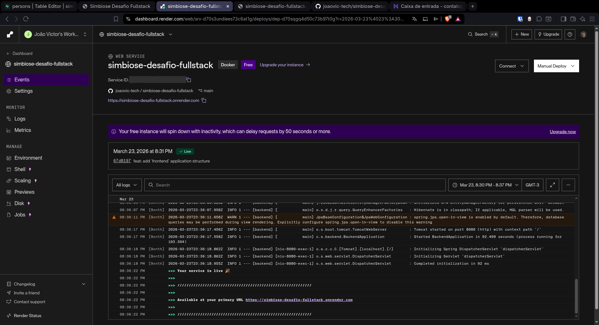
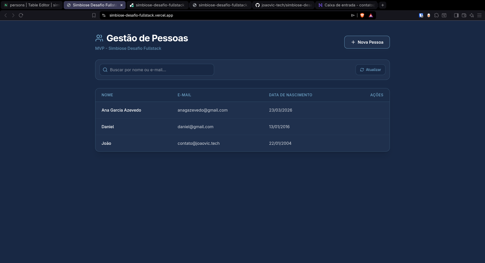
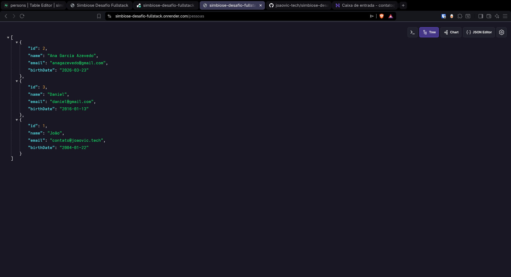
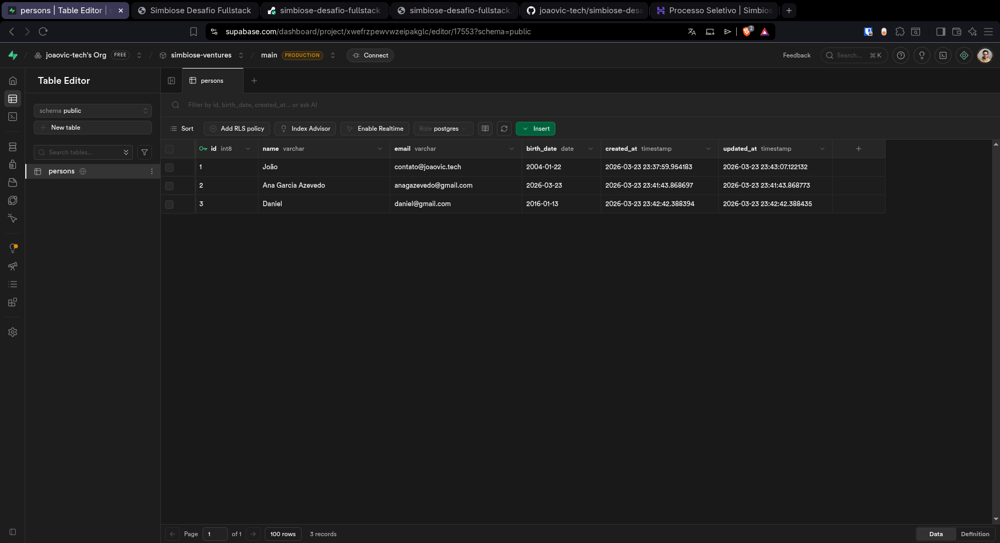

# SIMBIOSE VENTURES DESAFIO FULL-STACK

Este repositório foi criado para solucionar um desafio técnico full-stack.

## Stack Utilizada

| Camada | Tecnologias |
|--------|-------------|
| **Backend** | Java 21, Spring Boot 4.0.3, PostgreSQL 16, Maven, Docker |
| **Frontend** | Next.js 15, React 19, TypeScript 5.9, Tailwind CSS 4 |

## Telas da Aplicação

| Dashboard Principal | Design do Site |
|:---:|:---:|
|  |  |

| API - Lista de Pessoas | Banco de Dados |
|:---:|:---:|
|  |  |

## Proposta do Desafio

Para entender todos os requisitos e critérios de avaliação, consulte o documento completo:

[**Acesse a proposta aqui**](./docs/desafio.md)

## Como Executar Localmente

### Pré-requisitos

- Docker e Docker Compose
- Node.js 20+ e npm
- Git

### Passo a passo

1. **Clone o repositório:**

```bash
git clone https://github.com/joaovic-tech/simbiose-desafio-fullstack.git
cd simbiose-desafio-fullstack
```

2. **Configure o banco de dados:**

```bash
cd backend
cp .env.example .env
# Edite o .env com suas configurações
docker compose up -d
```

3. **Inicie o Backend:**

```bash
# Na pasta backend
docker build -t simbiose-backend .
docker run -p 8080:8080 --env-file .env --network simbiose-network simbiose-backend
```

Ou usando Maven (requer Java 21):

```bash
./mvnw spring-boot:run
```

4. **Inicie o Frontend:**

```bash
cd ../frontend
cp .env.example .env
npm install
npm run dev
```

5. **Acesse a aplicação:**

- Frontend: http://localhost:3000
- Backend API: http://localhost:8080

## Decisões de Arquitetura

A ideia inicial foi criar um **MVP** focado nos requisitos principais do desafio, evitando a complexidade de um sistema completo de autenticação. Essa abordagem permitiu dedicar mais tempo à qualidade do código, testes automatizados e experiência do usuário.

**Foco de Engenharia (TDD)**: Vale destacar que a minha principal atuação no desenvolvimento deste projeto foi focada no **backend guiado a testes (TDD - Test-Driven Development)**. A maior parte dos meus commits no repositório reflete essa dedicação e priorização em garantir uma robusta cobertura de testes, validação das regras de negócio e estabilidade da API em Spring Boot.

## Ferramentas de IA Utilizadas

Este projeto foi desenvolvido com auxílio das seguintes ferramentas de inteligência artificial:

| Modelo | Uso |
|--------|-----|
| **Google Gemini 3.1 Pro** | Debate de documentação e refinamento de requisitos |
| **Kimi K2.5 Cloud** | Discussões de arquitetura e ajustes estruturais |
| **Claude Opus 4.6** | Implementação de código e revisões técnicas |
| **ai.studio** | Criação inicial do projeto Next.js (frontend) que depois foi exportado para conexão com o backend |

---

## Feedback

> **Todo feedback é bem-vindo!**
> Seja sobre padrões de código, estrutura de pastas, escolhas de tecnologia ou qualquer outro aspecto — adoraria ouvir sua opinião sobre esta resolução. Sinta-se à vontade para abrir uma issue ou entrar em contato!

---

*Desenvolvido com ☕ e muita dedicação para o desafio Simbiose Ventures.*
